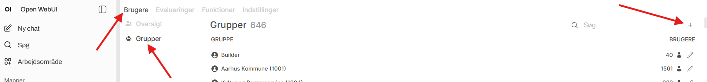

# Builder rolle og rettigheder

## Konfiguration af builder rolle

OpenWebUI kommer med to roller:

- bruger
- administrator

I AAK blev det hurtigt tydeligt at der var behov for en rolle der kunne bygge specialister/assistenter,
samt en rolle der kune kunne anvende specialister og assistenter. For at imødekomme dette har vi lavet builder-rollen.

Da OpenWebUI ikke understøtter flere roller har vi brugt rettihedssystemet til at lave rollen. Det er gjort således:

1. Opret en ny gruppe her: 
2. Navngiv gruppen "builder", skriv en passende beskrivelse
3. Under indstillingen "Hvem kan dele til denne gruppe" vælges "Medlemmer"
4. Gå til menupunktet "rettigheder" og konfigurer de rettigheder du ønsker
   (du kan se hvordan AAK har konfigureret her [AAK builder rettigheder](../builder/rettigheder.md))
5. Gem gruppen
6. Åbn gruppen igen for at tilføje medlemmer - det gøres i venstre side ved at trykke "Brugere"

Det kan godt være at du har brug at konfigurere rettighederne anderledes end vi har gjort i AAK, det skal du være så
velkommen til. Hvis du er i tvivl om hvad en rettighed betyder kan der måske hentes viden i OpenWebUIs dokumentation.
I AAK har vi mange grupper i systemet (500+) da vi udover rettighedgruppen "Builder", også har almindelige
brugergrupper der afhængere af brugerens organisatoriske indplacering. Som ansat i ITK Development tilhører jeg flg. grupper

- Aarhus Kommune
- MKB
- Borgerservice og Biblioteker
- ITK
- ITK Development

Dette er for at vi kan dele specialister/assistenter til de relevante brugere. Det er også derfor at indstillingen
"Medlemmer" i punkt 3 giver rigtig meget mening for os (du kan som builder kun dele i grupper du selv er i = din
egen organisation), men også fordi at en liste på 500+ grupper at dele med at lidt uoverskuelig.

Har du ikke så mange grupper i dit system giver det måske mening for dig at vælg "Alle" i punkt 3 i stedet.

## Standard rettigheder

I bunden af gruppe listen er en knap til "standard rettigheder" nye grupper der bliver oprettet vil arve de
rettigheder der er konfigureret her. Vi bruger standardrettighederne til vores organisatoriske grupper og de
dækker over de rettigheder man har som almindelig bruger af systemet (altså ikke builder-rettigheder). Når en
bruger kun placeres i en organsiatorisk gruppe har vedkommende så "kun" standardrettighederne, og det er derfor
ikke nødvending at have en ekstra rolle-gruppe til en almindelig bruger. Du kan se hvordan vores standard
rettigheder er konfigureret her: [slutbruger rettigheder](../slutbruger/rettigheder.md).

## Base modeller

På base modellerne (sprogmodelerne) kan man indstille hvem der har rettighed til at anvende dem. Der har AAK valgt
kun at dele basemodellen med "builders", så den almindelige slutbruger ikke har mulighed for at chatte direkte med
en sprogmodel, men kun med en assistent der er delt med dem. Det betyder også at slutbrugere der ikke er i en
organisatorisk gruppe ikke vil have adgang til nogen modeller/specialister/assistenter.
