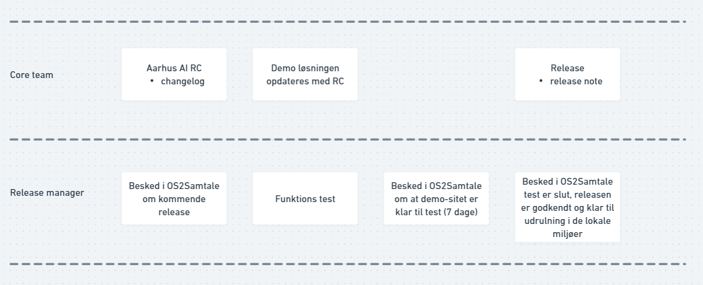

# Release management

Release management er opgaven med at klaregøre en ny release til produktion. Dette indebærer klargøring af en release
candidate (RC) til test, håndtering af testfeedback og klargøring af den endelige release. Når der er kommet en endelig
release skal andvendere sammen med deres leverandør selv planlægge deres egen release til deres produktions miljø.
Opgaven med release management håndteres af en release manager, det er beskrevet nedenfor hvordan denne udføres.

## Proces

1. Der kommer ny release af OpenWebUI, eller andre dele af AarhusAI
2. Core team laver en Release Candidate
3. Der informeres ud i OS2Samtale Release tråden at der er en ny release på vej, og hvad den indeholder
4. Release Candidate lægges på demostitet af Core Team
5. Release Manager tester på demositet, udfra de testcases der kan findes her:
   [https://aarhusai.github.io/documentation/admin/testcases.html](https://aarhusai.github.io/documentation/admin/testcases.html).
   Vær opmærksom på at det er funktionelle tests.
6. Release Manager skriver ud i OS2Samtale Release tråden at den nye release er klar til test, anvendere har 7 dage
   til at teste før releasen godkendes
7. Core team laver release og opdaterer changelog
8. Release Manager skriver ud i OS2Samtale Release tråden at den nye release er godkendt og klar til at blive rullet
   ud.

