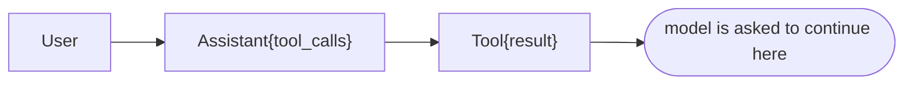
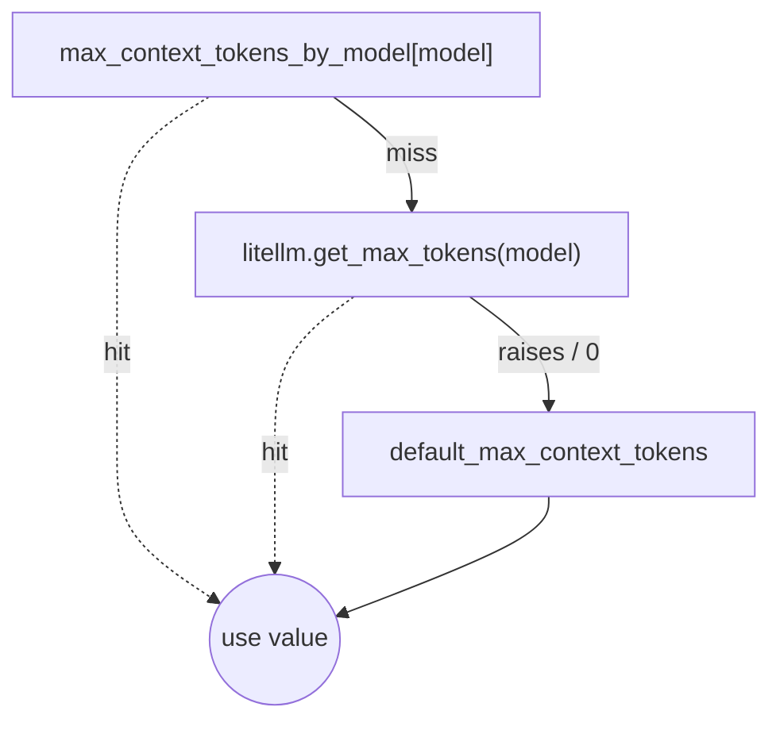
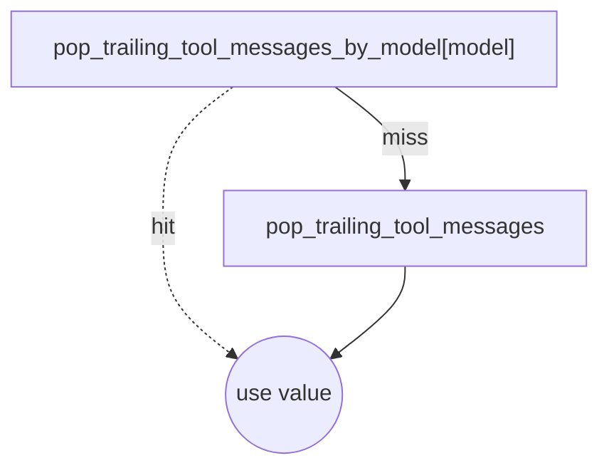

# LiteLLM guardrails

LiteLLM guardrails are a way to execute code on and around input and output sent to and from models managed by LiteLLM.

The Open WebUI instance sends requests to LiteLLM, but does not support setting guardrails on a per-request basis. For
this reason, guardrails that should execute on messages from Open WebUI should be set as always on, by setting the
`default_on` setting to `true` when declaring the guardrail (see below).

## Currently, shipped guardrails

| Guardrail                  | Type     | File                                                                                                                                     | What it does                                                                                                                                                                                                  |
|----------------------------|----------|------------------------------------------------------------------------------------------------------------------------------------------|---------------------------------------------------------------------------------------------------------------------------------------------------------------------------------------------------------------|
| `MessageTrimmingGuardrail` | Pre-call | [`message-trimming`](https://github.com/os2ai/helm-deployments/blob/develop/applications/litellm/templates/message-trimming-config.yaml) | Trims oversized message histories to fit the target model's context window, then sanitizes tool-call/tool-response pairings so the trimmed (or otherwise broken) history doesn't crash strict chat templates. |

Pre-call guardrails in [LiteLLM](https://github.com/BerriAI/litellm) proxy applies to inbound chat requests before
forwarding them to the upstream model.

## Usage

The message trimming guardrail can be configured in the litellm
values [file](https://github.com/os2ai/helm-deployments/blob/develop/applications/litellm/litellm-values.yaml#L108)
configuration file in the helm chart.

__Note__: that the default configuration contains an option to set max tokens for a named model, which overrides the
global default max tokens value. This is useful for models that have a different context window size than the global
default.

```yaml
model_list:
  - model_name: my-model
    litellm_params:
      model: openai/some-deployed-model
      api_base: https://...
      api_key: ""
      max_tokens: 8192
    guardrails:
      # attach the guardrail to this model
      - message_trimming

guardrails:
  - guardrail_name: message_trimming
    litellm_params:
      guardrail: /app/custom_guardrails/message_overflow.MessageTrimmingGuardrail
      mode: pre_call
      default_on: true
    default_config:
      trim_ratio: 0.75
      max_output_tokens: 2000
      safety_buffer: 500
      debug: false
      default_max_context_tokens: 8192
      max_context_tokens_by_model:
        openai/some-deployed-model: 32768
      pop_trailing_tool_messages: false
```

## How Message Trimming works

`async_pre_call_hook` runs on every chat completion request. The flow:

1. __Resolve context window__ for the target model (`_resolve_max_context_tokens`):
   per-model override map → `litellm.get_max_tokens` → global default. Logs a warning if it falls through to the global
   default.
2. __Compute a safe completion budget__ (`_calculate_safe_completion_tokens`) — leaves room for input + safety buffer +
   a 25% headroom factor for tokens LiteLLM/the provider may add later.
3. __Update `max_tokens` / `max_completion_tokens`__ in the request so the model can't be asked for more than fits.
4. __Trim input messages__ (`litellm.trim_messages`) if `current_input_tokens > max_input_tokens`, dropping older
   messages from the head until it fits.
5. __Sanitize__ (`_sanitize_messages`):
    - `_repair_tool_call_pairings` — strip orphan `role: tool` messages and orphan `tool_calls` entries that the trimmer
      may have created.
    - (Optional, opt-in via `pop_trailing_tool_messages`) pop trailing `role: tool` messages and re-run the repair, then
      append `"Please continue"` if the new terminus is an assistant message.
6. __Recount and re-budget__ completion tokens once more, since sanitize may have grown or shrunk the message list.

### Why `_repair_tool_call_pairings` exists

LiteLLM's build in `trim_messages` has __no tool-call awareness__ — it drops messages by token count from the head and
freely produces:

- Orphan `role: tool` messages (no surviving `assistant.tool_calls` advertised them).
- Orphan `tool_calls` entries on assistant messages (no surviving `role: tool` answered them).

Both shapes are rejected by strict chat templates (Mistral, vLLM, OpenAI strict mode). The repair pass enforces the
invariant: every surviving `tool_calls[].id` has a later matching `role: tool` message, and every surviving `role: tool`
was advertised by an earlier surviving `assistant.tool_calls` entry. See `_repair_tool_call_pairings` in [`message-trimming`](https://github.com/os2ai/helm-deployments/blob/develop/applications/litellm/templates/message-trimming-config.yaml).

### Why the trailing-tool pop is opt-in

The "normal" agent-loop shape ends on a `role: tool` message:



Most providers (OpenAI, Anthropic, Google, Mistral via the official APIs) __accept__ this shape — that's how tool
calling works. Popping the tool message and substituting `"Please continue"` deprives the model of the result it was
supposed to reason from, so the default is __off__.

Set `pop_trailing_tool_messages: true` only for upstream chat templates that explicitly reject `role: tool` messages —
notably the strict HuggingFace template that raises `"Only user and assistant roles are supported!"`. The per-model
override map lets you flip it for one model in a fleet without affecting the others.

### Why both repairs run when pop is enabled

The order is `repair → pop → repair → maybe-append-continue`:

- The first repair cleans up orphans created by `trim_messages`.
- The pop may break a previously-valid `[Assistant{tool_calls=[X]}, Tool X]` pair, leaving the assistant holding orphan
  `tool_calls`.
- The second repair restores the invariant — strips the now-orphan `tool_calls`, drops content-empty assistants
  entirely.
- *Then* we decide whether to append `"Please continue"`, after seeing the post-repair terminus. (Appending before would
  risk leaving a stale "user-continue" line after a now-deleted assistant.)

## Configuration reference

Read from `default_config` of the guardrail entry in `litellm_config.yaml`. All keys optional.

| Key                                   | Type  | Default | Purpose                                                                                                                                                                                                                                                                                                                                                       |
|---------------------------------------|-------|---------|---------------------------------------------------------------------------------------------------------------------------------------------------------------------------------------------------------------------------------------------------------------------------------------------------------------------------------------------------------------|
| `trim_ratio`                          | float | `0.75`  | Forwarded to `litellm.trim_messages`. Fraction of `max_tokens` that trimming aims for, leaving headroom for additions later in the pipeline.                                                                                                                                                                                                                  |
| `max_output_tokens`                   | int   | `2000`  | Default completion budget when the request specifies neither `max_tokens` nor `max_completion_tokens`.                                                                                                                                                                                                                                                        |
| `safety_buffer`                       | int   | `500`   | Reserved tokens carved out of the context window before computing input/output budgets — covers system prompts, function schemas, and other tokens added downstream.                                                                                                                                                                                          |
| `debug`                               | bool  | `false` | When `true`, the guardrail prints `[GUARDRAIL]`-prefixed traces to stdout. Show up in `task compose -- logs -f litellm`.                                                                                                                                                                                                                                      |
| `default_max_context_tokens`          | int   | `8192`  | Fallback context-window size when neither `max_context_tokens_by_model` nor `litellm.get_max_tokens` resolves the model. __Bump this if your fleet's smallest model is bigger than 8k.__                                                                                                                                                                      |
| `max_context_tokens_by_model`         | dict  | `{}`    | Per-model overrides keyed by the upstream `model:` value LiteLLM forwards (NOT the friendly `model_name`). Wins over `litellm.get_max_tokens`. Use this for vLLM, Bedrock variants, custom deployments — anything not in [`litellm/model_prices_and_context_window.json`](https://github.com/BerriAI/litellm/blob/main/model_prices_and_context_window.json). |
| `pop_trailing_tool_messages`          | bool  | `false` | Strip trailing `role: tool` messages before forwarding. __Leave `false` unless the upstream chat template rejects them__ — popping loses tool-call results the model needs to reason from.                                                                                                                                                                    |
| `pop_trailing_tool_messages_by_model` | dict  | `{}`    | Per-model override of the flag above, same key shape as `max_context_tokens_by_model`.                                                                                                                                                                                                                                                                        |

### Resolution order, illustrated

__Context window__ — first hit wins:



__Pop trailing tools__ — first hit wins:



## References

- [LiteLLM custom guardrail docs](https://docs.litellm.ai/docs/proxy/guardrails/custom_guardrail)
